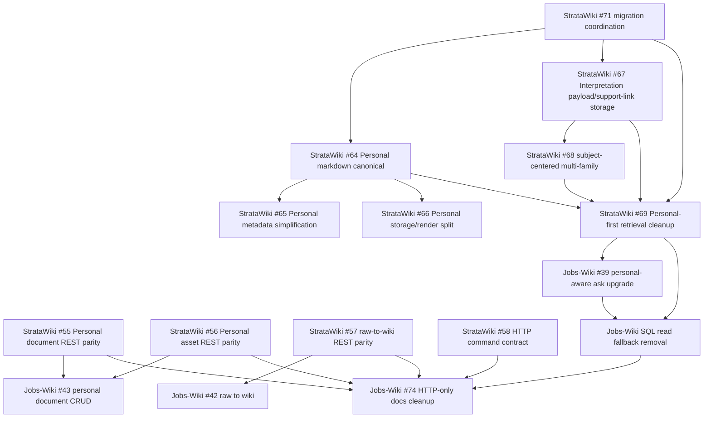

# Architecture Reframe Migration Coordination

## Purpose

This note is the migration coordinator document for `binnini/stratawiki#71`.

It covers:

- execution order across StrataWiki and Jobs-Wiki
- blocker and dependency mapping
- where dual read, dual write, and compatibility shims are actually needed
- rollout smoke gates and rollback boundaries
- criteria for removing deprecated paths

This is intentionally a coordination note, not an ownership transfer. StrataWiki continues to own DB/runtime/HTTP compatibility. Jobs-Wiki continues to own workspace adoption, frontend-facing contract use, and cutover timing on the consumer side.

## Working Assumptions

- Evidence is based on the local workspace state on `2026-04-22`.
- The migration must stay incremental. No big-bang switch is assumed.
- A compatibility path should exist only where code still needs it. Do not preserve legacy paths just because old docs mention them.

## Current State Snapshot

### StrataWiki

| Issue | Local status | Evidence in repo | Migration meaning |
| --- | --- | --- | --- |
| `#64 Personal layer를 markdown canonical 구조로 전환` | partial-to-mostly-landed | `config/postgres/migrations/20260422_personal_markdown_canonical.sql`, `src/wiki_mcp/personal_markdown_migration.py`, `src/wiki_mcp/services/personal_document_bodies.py`, `tests/test_personal_markdown_migration.py` | Markdown body canonicalization is already real enough to migrate around, but the cleanup boundary is not fully closed. |
| `#65 Personal metadata schema를 registry 중심으로 단순화` | partial | `personal.record` has `path`, `subspace`, `content_hash`, `version`, `asset_refs_json`, but repository/service code still treats `summary` and richer metadata as first-class | Metadata-only intent is present, but DB shape is not minimal yet. |
| `#66 Personal CRUD에서 storage/render 책임 분리` | partial | `PersonalDocumentBodyStore` exists, but `PersonalDocumentService` still orchestrates repository, render swap, summary, and validation together | Enough separation exists to migrate safely, but not enough to remove all legacy coupling yet. |
| `#67 Interpretation storage를 metadata + payload + support link 구조로 재설계` | partial | `interp.payload` and `interp.support_link` are read/written, but `interp.record` still persists `evidence_json` and `relations_json` and projects them back | This is the main internal dual-write seam. |
| `#68 Interpretation 생성과 발행을 subject-centered multi-family 구조로 전환` | partial | family registry exists and publication slot already filters by `family + kind + subject`, but the only concrete builder is still `market_trend` | The shape is moving, but downstream should still treat multi-family as transitional. |
| `#69 Retrieval/graph를 Personal-first support surface로 재정렬` | mostly landed in core, not fully cleaned up cross-repo | `CuratedRetrievalService` default order is `Personal -> Interpretation -> Fact`; anchor reverse lookup is optional support only | Internal retrieval policy is largely in place, but Jobs-Wiki still carries downstream compatibility/fallback behavior. |
| `#71 migration coordination` | pending in docs | this document | Coordination issue becomes the source of truth for sequence and removal gates. |

### Jobs-Wiki

| Issue | Local status | Evidence in repo | Migration meaning |
| --- | --- | --- | --- |
| `#27 StrataWiki write client` | landed as HTTP-only | `apps/ingestion/src/clients/stratawiki-write-client.js` rejects non-HTTP mode | For write traffic, there is no real wrapper fallback anymore. Plan around HTTP compatibility, not transport rollback. |
| `#36 profile-context provisioning` | landed enough for rollout | ask/personal client and smoke scripts call profile sync over HTTP | Cross-repo profile ordering is available now. |
| `#39 personal-aware ask upgrade` | partial | ask path still keeps read-backed source-first fallback and upgrades only when profile/personal path succeeds | Keep fallback until retrieval contract cleanup is complete. |
| `#42 personal raw -> wiki generation` | locally implemented against real upstream | document routes and personal knowledge client call dedicated REST endpoints | No need for new generic bridge work here. |
| `#43 personal document CRUD and asset registration` | locally implemented against real upstream | document routes and personal knowledge client call dedicated REST endpoints | The upstream contract exists; remaining work is cleanup and rollout confidence. |
| `#74 Remove bridge-phase guidance and document HTTP-only baseline` | pending | current docs still describe bridge/wrapper rollback more broadly than code supports | This should trail real migration completion, not lead it. |

## Key Coordination Conclusion

The practical compatibility picture is narrower than some docs imply.

- `Jobs-Wiki` write, personal document, and command flows are already effectively `HTTP-only` in code.
- The remaining meaningful compatibility seams are:
  - `Jobs-Wiki` read authority `sql|http`
  - `StrataWiki` interpretation storage dual shape
  - `Jobs-Wiki` ask/evidence lookups that still use `/api/v1/tool-calls`
  - `StrataWiki` Personal markdown migration helpers that read legacy comment metadata during backfill

That means the migration should optimize for shrinking those seams quickly instead of maintaining a broad wrapper-era dual mode that no longer matches the implementation.

## Recommended Execution Order

### Phase 0. Lock the migration envelope

Owner split:

- StrataWiki owns schema migration order, backfill tools, HTTP compatibility, and legacy projection shims.
- Jobs-Wiki owns read cutover timing, workspace contract adoption, and consumer smoke orchestration.

Deliverables:

- use this document as the canonical order for `#71`
- do not remove any compatibility path before its explicit removal gate below is met
- do not promise wrapper rollback for write/personal/command flows that are already HTTP-only in code

Exit gate:

- both repos agree that the only long-lived remaining dual-read seam is `Jobs-Wiki` read authority

### Phase 1. Finish the Personal markdown-canonical cutover first

Why first:

- `#64/#65/#66` are prerequisites for safe Personal workspace semantics
- `#69` depends on Personal retrieval being markdown-canonical
- Jobs-Wiki workspace CRUD/generation already assumes the Personal HTTP contract exists

Execution order:

1. Apply the `personal.record` schema migration.
2. Run metadata backfill through `personal_markdown_migration.py` without file rewrite first.
3. Validate that direct Personal read-after-write and retrieval still behave with markdown body as canonical source.
4. Only after validation, decide whether to run `--rewrite-files` and/or `--prune-legacy-provenance`.

Why no dual write here:

- Personal canonical content should converge on markdown body only.
- DB should remain metadata/registry-oriented.
- Writing the same body canonically to two sources would extend ambiguity instead of reducing it.

Compatibility shim needed here:

- yes: legacy body comment parsing during backfill
- yes: legacy provenance key `_personal_document` until rewrite/prune is complete
- no: long-lived body dual write

Rollback boundary:

- before file rewrite, rollback is still cheap because files remain untouched
- after file rewrite, rollback requires a render-root backup or filesystem snapshot; do not treat it as instant

Exit gate:

- Personal CRUD works through HTTP and read-after-write matches the markdown file body
- backfilled records have stable `subspace`, `version`, `content_hash`, and `asset_refs_json`

### Phase 2. Stabilize the cross-repo Personal/workspace contract

Why second:

- Jobs-Wiki already uses the dedicated Personal REST surface
- contract stabilization should happen before deeper interpretation/retrieval cleanup removes old fallback expectations

Execution order:

1. Treat StrataWiki Personal REST endpoints as the canonical external workspace contract.
2. Keep Jobs-Wiki consuming those endpoints for CRUD, assets, and raw-to-wiki generation.
3. Keep `/api/v1/tool-calls` only for the remaining ask/evidence lookups that still require it.
4. Update migration notes and docs after the technical contract is stable, not before.

Compatibility shim needed here:

- yes: `/api/v1/tool-calls` for `get_profile_context`, `get_personal_record`, `get_interpretation_record`, `get_fact_record`
- no: wrapper fallback for personal CRUD/generation
- no: wrapper fallback for ingestion write client
- no: wrapper fallback for command facade

Cross-repo blocker:

- StrataWiki must not remove those tool-call-backed read helpers until Jobs-Wiki ask/evidence hydration no longer depends on them.

Exit gate:

- Jobs-Wiki workspace authoring uses only dedicated Personal REST endpoints for mutation paths
- only read-side lookup helpers remain on `/api/v1/tool-calls`

### Phase 3. Move Interpretation internals without breaking downstream readers

Why third:

- `#67/#68` are internal StrataWiki shape changes that feed `#69`
- Jobs-Wiki should not absorb the new interpretation shape directly until StrataWiki has finished projecting a stable compatibility contract

Execution order:

1. Keep `payload` and `support_links` as the target canonical interpretation shape.
2. Continue projecting legacy `title/claim/summary/evidence/relations` from that shape while downstream consumers still expect them.
3. Expand subject-centered multi-family publication only after storage compatibility is stable.
4. Keep `market_trend` as the only guaranteed family until additional families actually exist in runtime and tests.

Dual write/read needed here:

- yes: temporary internal dual write/projection between `payload/support_links` and legacy `evidence_json/relations_json`
- yes: dual read through `materialize_interpretation_record`
- no: expose raw intermediate storage churn to Jobs-Wiki

Compatibility shim needed here:

- yes: `materialize_interpretation_record`
- yes: repository projection from `interp.payload` and `interp.support_link`
- yes: publication/read logic that still surfaces legacy fields

Cross-repo blocker:

- Jobs-Wiki should not switch to a new interpretation-specific consumer contract until StrataWiki says the support-link-based contract is stable enough to remove legacy fields.

Exit gate:

- new interpretation writes preserve current read behavior
- publication uniqueness and retrieval still behave correctly for `family + kind + subject + scope`

### Phase 4. Cut over retrieval and remove legacy read dependence last

Why last:

- `#69` depends on both Personal and Interpretation reframe work
- `Jobs-Wiki` still has the only significant live dual-read seam

Execution order:

1. Keep `JOBS_WIKI_READ_AUTHORITY_MODE=sql|http` during rollout validation.
2. Prove HTTP read parity with cross-repo smoke and real ask fallback behavior.
3. Keep source-first ask fallback until the Personal-first retrieval contract is stable enough in production-like runs.
4. Remove the SQL read fallback only after HTTP read parity is proven and rollback is no longer needed.

Dual write/read needed here:

- yes: Jobs-Wiki dual read (`sql|http`) for rollout window
- no: dual write

Compatibility shim needed here:

- yes: read-backed ask fallback while personal-aware upgrade remains optional
- yes: StrataWiki explanation/cache/snapshot read helpers used by Jobs-Wiki
- no: new DB-access path from Jobs-Wiki

Cross-repo blocker:

- Jobs-Wiki cannot remove SQL fallback until StrataWiki HTTP read endpoints and retrieval semantics are good enough to replace it for workspace, opportunities, calendar, sync visibility, and ask grounding.

Exit gate:

- repeated cross-repo HTTP smoke passes
- no known projection mismatch between SQL and HTTP read mode for supported screens
- ask fallback is exercised only as a resilience path, not as the normal path

### Phase 5. Remove deprecated paths and rewrite docs to match reality

This is the cleanup phase, not a prerequisite phase.

Removal order:

1. remove docs that present wrapper as the normal write/personal/command path
2. remove docs that present generic tool bridge as the normal Personal contract
3. remove Jobs-Wiki SQL read fallback after its explicit gate is met
4. remove StrataWiki interpretation legacy columns/projections only after downstream read contracts no longer require them
5. prune Personal legacy provenance and body comment metadata only after backfill/rewrite confidence is complete

Primary doc cleanup issue:

- `binnini/Jobs-Wiki#74`

## Dependency Graph

## Compatibility Checklist

| Area | Canonical target | Dual write | Dual read | Compatibility shim | Removal gate |
| --- | --- | --- | --- | --- | --- |
| Personal body storage | markdown file canonical, DB metadata-only | no | temporary legacy parse during migration | legacy body comment parse, `_personal_document` provenance | backfill validated and file rewrite decision completed |
| Personal CRUD/generation HTTP contract | dedicated REST endpoints | no | no | keep old tool lookup only where ask/evidence still uses it | Jobs-Wiki ask adapter no longer needs tool-call record hydration |
| Jobs-Wiki write transport | HTTP | no | no | none worth preserving in code | already HTTP-only; update docs rather than preserving wrapper myths |
| Jobs-Wiki command/sync transport | HTTP command facade | no | no | none worth preserving in code | already HTTP-only; update docs after rollout |
| Interpretation storage | payload + support links | yes, temporarily internal | yes, temporarily internal | `materialize_interpretation_record` and legacy field projection | downstream consumers stop requiring legacy evidence/relations/title/summary shape |
| Retrieval/read authority | StrataWiki HTTP read model | no | yes, in Jobs-Wiki only | SQL read fallback and ask source-first fallback | repeated HTTP parity checks and stable ask grounding |

## Smoke Test Gates

### Phase 1 Personal canonical gate

- StrataWiki:
  - `tests/test_personal_markdown_migration.py`
  - `tests/test_postgres_personal_repository.py`
  - `tests/test_http_runtime.py`
- Validate one create -> get -> update -> delete Personal document flow through HTTP.
- Validate one raw -> wiki generation flow still persists only into Personal.

### Phase 2 cross-repo Personal/workspace gate

- Jobs-Wiki:
  - `apps/was/test/stratawiki-personal-knowledge-client.test.js`
  - `apps/was/test/app.test.js`
  - `apps/was/test/stratawiki-command-facade-adapter.test.js`
  - `packages/integrations/stratawiki-http/test/client.test.js`
- Cross-repo:
  - `npm run smoke:http:cross-repo`

### Phase 3 interpretation/retrieval gate

- StrataWiki:
  - `tests/test_interpretation_repository_visibility.py`
  - `tests/test_interpretation_publication_service.py`
  - `tests/test_curated_retrieval_service.py`
  - `tests/test_market_trend_interpretation_builder.py`
- Confirm legacy-compatible read payloads still work even when canonical data lives in `payload/support_links`.

### Phase 4 final rollout gate

- Jobs-Wiki:
  - `apps/was/test/stratawiki-read-authority-adapter.test.js`
  - `apps/was/test/stratawiki-ask-adapter.test.js`
- Cross-repo:
  - `npm run smoke:http`
  - `npm run smoke:http:cross-repo`
  - optionally `npm run smoke:stack`
- Operational note:
  - `npm run smoke:http` temporarily repoints the recruiting fact snapshot pointer during validation and is expected to restore it before exit.
  - if the smoke is interrupted or leaves residue, run `npm run smoke:http:cleanup` before continuing rollout validation.

## Rollback Checklist

### General

- never remove a compatibility seam in the same change that introduces a new canonical path
- always keep one phase-local rollback point
- treat doc cleanup as the last step, not the first step

### Personal markdown migration rollback

- before applying the SQL migration, take a DB snapshot
- before `--rewrite-files`, take a render-root backup or filesystem snapshot
- if metadata backfill fails, stop before file rewrite
- if file rewrite causes mismatch, restore render-root backup and DB snapshot together

### Cross-repo read cutover rollback

- keep `JOBS_WIKI_READ_AUTHORITY_MODE=sql` available until HTTP parity is proven
- if HTTP read parity regresses, switch Jobs-Wiki back to `sql` read authority immediately
- do not couple SQL fallback removal to unrelated docs cleanup
- if `smoke:http` exits mid-run, restore the fact pointer before treating later failures as architecture regressions

### Ask path rollback

- keep source-first fallback active while personal-aware upgrade is still proving parity
- if personal-aware ask degrades, fall back to read-backed answer without changing the write/path contracts

### Interpretation storage rollback

- do not drop legacy interpretation columns while any downstream consumer still reads their projected shape
- if support-link-backed writes regress, keep writing/projecting the legacy fields until repository behavior is corrected

## Deprecated Path Removal Criteria

Remove a deprecated path only when all of the following are true for that path:

1. the new canonical path is already the default in code
2. the old path is no longer required for rollback
3. targeted tests pass for the replacement path
4. cross-repo smoke proves the replacement path in a realistic flow
5. docs can be updated without lying about current runtime behavior

Applied to current migration:

- remove broad wrapper-era guidance first in docs, because write/personal/command flows are already HTTP-only in code
- remove Jobs-Wiki SQL read fallback last, because it is still the real rollout safety valve
- remove StrataWiki `/api/v1/tool-calls` usage only after Jobs-Wiki ask/evidence hydration no longer depends on it
- remove Personal legacy provenance/body comments only after the markdown-canonical rollout is settled
- remove interpretation legacy fields only after downstream contracts are explicitly moved off them

## Blocker Summary

- `StrataWiki #64/#65/#66` block the clean Personal canonical story and part of `#69`.
- `StrataWiki #67/#68` block the clean interpretation/retrieval story and the rest of `#69`.
- `StrataWiki #69` blocks final Jobs-Wiki read fallback removal and the clean completion of `Jobs-Wiki #39`.
- `Jobs-Wiki #74` is blocked by actual migration completion; it should not define the migration order.
- The strongest live rollback lever is `Jobs-Wiki` HTTP-vs-SQL read authority, not wrapper-vs-HTTP write transport.
